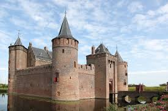

# 🏰 RouteParel - Nederlandse Routes App

**Live Demo**: [Bekijk de applicatie](https://github.com/JohanSieraad/Routepare-) 

Een moderne web applicatie voor het ontdekken van historische routes door Nederland, België en andere regio's. Met persoonlijke aanbevelingen, audiogidsen en Google Maps integratie.


## ✨ Features

- 🏰 **Kasteel Routes** - Ontdek historische kastelen zoals Muiderslot en Kasteel Bouillon
- 🗺️ **Google Maps Integratie** - Interactieve kaarten met route planning
- 📱 **Responsive Design** - Werkt perfect op desktop, tablet en mobiel
- 🎧 **Audio Gidsen** - Luister naar verhalen tijdens je reis
- ⭐ **Persoonlijke Aanbevelingen** - Routes aangepast aan jouw voorkeuren
- 📸 **Foto Galerij** - Bekijk mooie foto's van bestemmingen
- 🚗 **Auto Routes** - Optimaal voor auto reizen met parkeer informatie

## 🚀 Live Applicatie

**GitHub Pages**: De app draait automatisch op: `https://johansieraad.github.io/Routepare-/`

**Demo Versie**: Voor een directe preview bekijk: [static-build.html](static-build.html)

**Lokaal Draaien:**
```bash
# 1. Clone de repository
git clone https://github.com/JohanSieraad/Routepare-.git
cd Routepare-

# 2. Installeer dependencies
npm install

# 3. Start development server
npm run dev
```

Bezoek: http://localhost:5000

## 🛠 Tech Stack

- **Frontend**: React 18 + TypeScript + Vite + Tailwind CSS
- **Backend**: Node.js + Express.js + TypeScript  
- **Database**: PostgreSQL + Drizzle ORM
- **UI**: shadcn/ui (Radix UI components)
- **Maps**: Google Maps JavaScript API
- **State**: TanStack Query (React Query v5)
- **Deployment**: Docker + GitHub Actions

## 📦 Project Structuur

```
RouteParel/
├── client/                 # React frontend
│   ├── src/
│   │   ├── components/     # UI componenten
│   │   ├── pages/         # App pagina's
│   │   └── hooks/         # Custom React hooks
├── server/                # Express backend
│   ├── routes/           # API endpoints
│   └── middleware/       # Server middleware
├── shared/               # Gedeelde types en schema's
├── attached_assets/      # Foto's en media bestanden
└── docs/                 # Documentatie

```

## 🌟 Route Highlights

### Kastelen Route Noord-Holland
- **Muiderslot** - Historisch kasteel uit de 13e eeuw
- **Slot Zuylen** - Renaissance kasteel met prachtige tuinen
- **Kasteel Bouillon** - Middeleeuwse vesting in België

### Features per Route
- 📍 GPS coördinaten en navigation
- 🏛️ Historische achtergrond informatie
- 📸 Professionele foto galerij
- 🍽️ Restaurant aanbevelingen onderweg
- 🚗 Parkeer informatie en toegankelijkheid

## 🔧 Development

### Environment Setup
```bash
# Kopieer environment template
cp .env.example .env

# Configureer je API keys:
GOOGLE_MAPS_API_KEY=your_google_maps_key
DATABASE_URL=your_postgresql_url
```

### Database Setup
```bash
# Push schema naar database
npm run db:push

# Genereer Drizzle types
npm run db:generate
```

### Build & Deploy
```bash
# Production build
npm run build

# Docker deployment
docker-compose up --build
```

## 🚀 Deployment

De app is volledig geconfigureerd voor deployment op:

- **GitHub Pages** (Static hosting)
- **Vercel** (Serverless)
- **Railway** (Full-stack)
- **DigitalOcean** (Docker)

### Automatische Deployment
GitHub Actions is geconfigureerd voor:
- ✅ Automatic builds bij elke push
- ✅ Database migraties
- ✅ Production deployment
- ✅ Health checks

## 📱 Screenshots

### Desktop Interface


### Mobile Responsive


## 🤝 Contributing

1. Fork het project
2. Maak een feature branch (`git checkout -b feature/AmazingFeature`)
3. Commit je changes (`git commit -m 'Add some AmazingFeature'`)
4. Push naar de branch (`git push origin feature/AmazingFeature`)
5. Open een Pull Request

## 📄 License

Dit project is gelicenseerd onder de MIT License - zie [LICENSE](LICENSE) voor details.

## 👨‍💻 Auteur

**Johan Sieraad**
- GitHub: [@JohanSieraad](https://github.com/JohanSieraad)
- Email: johan.sieraad30@gmail.com

## 🙏 Acknowledgments

- Dank aan alle kastelen en historische locaties voor de inspiratie
- React en TypeScript communities voor de geweldige tools
- Nederlandse toerisme sector voor de ondersteuning

---

**⭐ Star dit project als het je bevalt!**